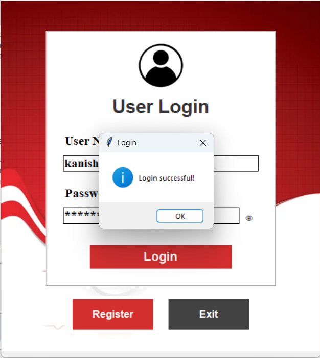
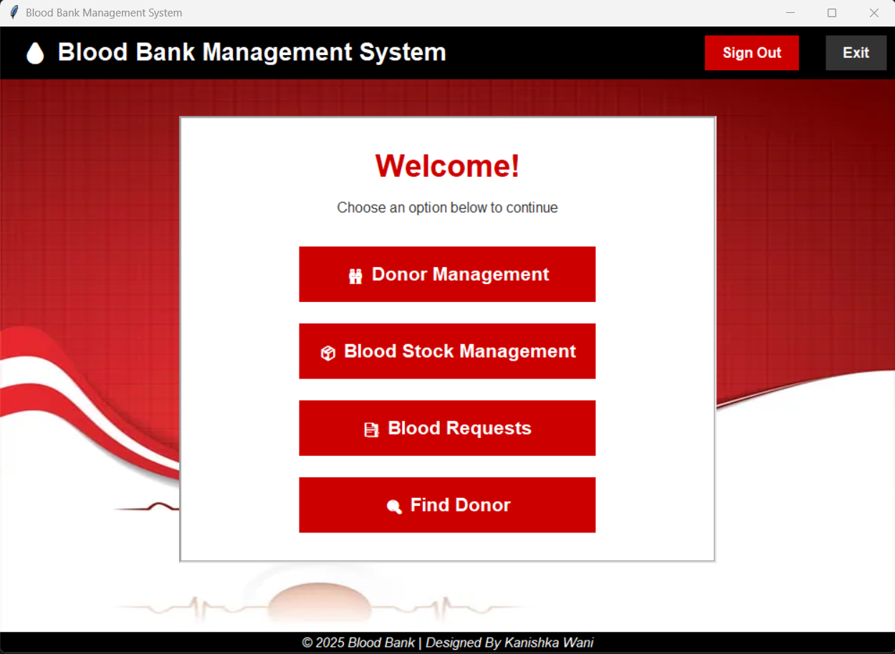
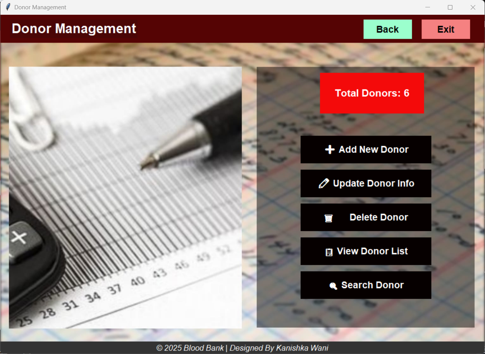
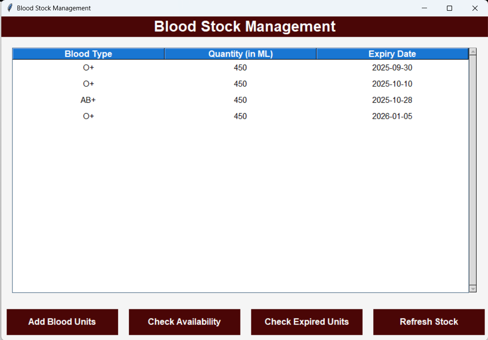
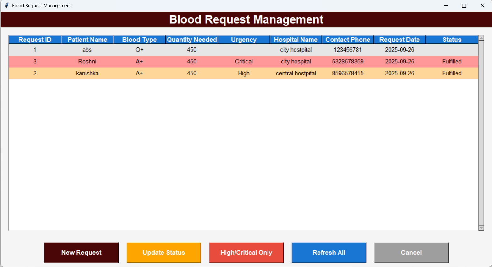
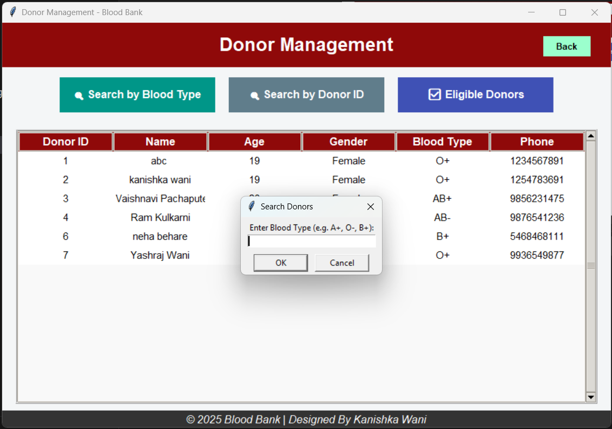
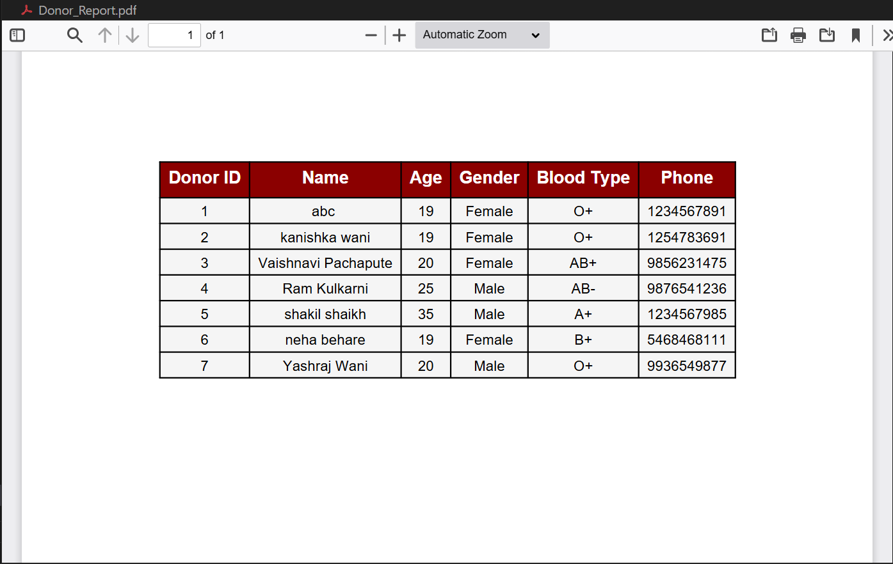

<div align="center">

# 🩸 𝘽𝙡𝙤𝙤𝙙 𝘽𝙖𝙣𝙠 𝙈𝙖𝙣𝙖𝙜𝙚𝙢𝙚𝙣𝙩 𝙎𝙮𝙨𝙩𝙚𝙢  
✨ *Donate Blood. Save Lives.* ✨  
>
>
>

**Python + Tkinter + MySQL Desktop Application**

[](https://python.org)
[](https://mysql.com)
[](https://docs.python.org/3/library/tkinter.html)

*A streamlined solution for managing blood donations and inventory*

</div>

---

## 📌 Features
- ✅ Donor Registration & Management
- ✅ Real-time Blood Stock Tracking  
- ✅ Blood Request Processing
- ✅ Low Stock Alerts & Notifications
- ✅ Report Generation & Export
- ✅ Secure Login System

---

## 🚀 Quick Start

```bash
# Clone & Install
git clone https://github.com/Kanishka-Wani/Blood-Bank-Management-System.git
cd Blood-Bank-Management-System
pip install mysql-connector-python

# Setup Database
mysql -u root -p
CREATE DATABASE bloodbank;
USE bloodbank;
SOURCE bloodbank.sql;

# Run Application
python main.py
```
---

## ⚙️ Tech Stack
Frontend: Tkinter GUI

Backend: Python 3.x

Database: MySQL

Package: mysql-connector-python

---

## 📸 Screenshots

### 👤 User Login Successful 
<p align="center">
  
</p>

---
### 🏠 Dashboard  
<p align="center">
  
</p>

---

### 👤 Donor Management  
<p align="center">
  
</p>

---

### 🩸 Blood Stock Overview  
<p align="center">
  
</p>

---

### 🩸 Blood Request Overview  
<p align="center">
  
</p>

---

### 📝 Add New Donor  
<p align="center">
  
</p>

---

### 📝 Find Donor  
<p align="center">
  
</p>

---

### 📄 Generate Report  
<p align="center">
  
</p>

---

## 🎥 Working Application Video 
[](https://youtu.be/your-video-link)

---
## 👤 Author
Kanishka Dinesh Wani

📧 kanishkawani52@gmail.com

🔗 https://github.com/Kanishka-Wani


---
<div align="center">
"One donation can save three lives."

⭐ Star this repo if you find it useful! ⭐

</div>

